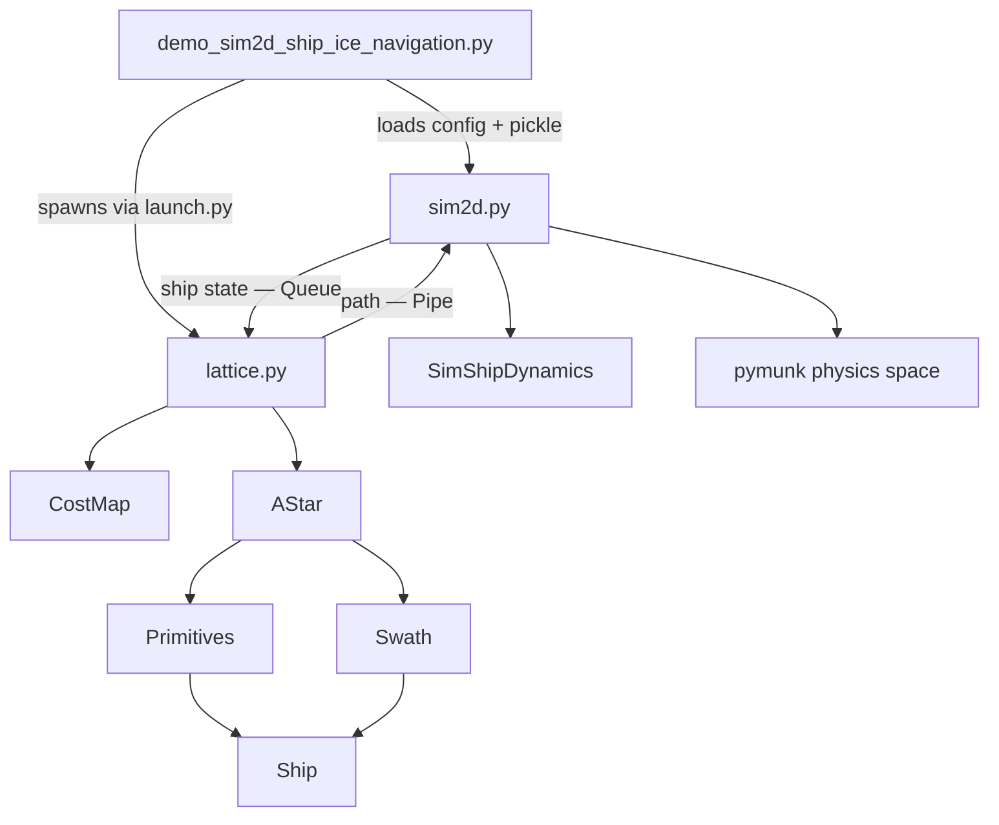

# Simulation Pipeline Diagram

```mermaid
graph TD
    A[demo_sim2d_ship_ice_navigation.py] -->|loads config + pickle| B[sim2d.py]
    A -->|spawns via launch.py| C[lattice.py]
    B -->|ship state — Queue| C
    C -->|path — Pipe| B
    B --> D[SimShipDynamics]
    B --> E[pymunk physics space]
    C --> F[CostMap]
    C --> G[AStar]
    G --> H[Primitives]
    G --> I[Swath]
    H --> J[Ship]
    I --> J
```
